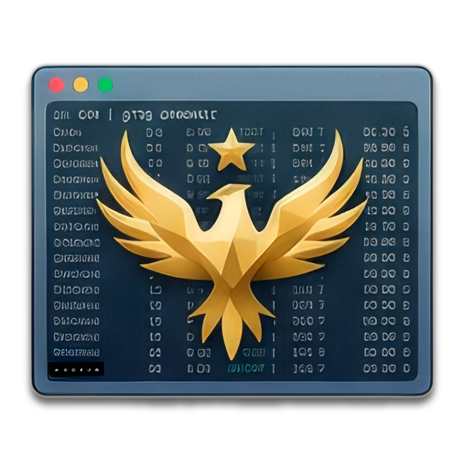

<p align="center"></p>

<h1 align="center">crex <sup><sub>(cmux-resurrect)</sub></sup></h1>

<p align="center">
  <a href="https://github.com/drolosoft/cmux-resurrect/actions/workflows/ci.yml"></a>
  <a href="https://goreportcard.com/report/github.com/drolosoft/cmux-resurrect"></a>
  <a href="https://pkg.go.dev/github.com/drolosoft/cmux-resurrect"></a>
  <a href="https://codecov.io/gh/drolosoft/cmux-resurrect"></a>
  <a href="https://opensource.org/licenses/MIT"></a>
  <a href="https://github.com/drolosoft/homebrew-tap"></a>
  <a href="https://github.com/drolosoft/cmux-resurrect/releases"></a>
  <a href="https://github.com/manaflow-ai/cmux"></a>
</p>

> **Save, restore, and template your terminal workspaces — for [cmux](https://github.com/manaflow-ai/cmux) and [Ghostty](https://ghostty.org/).**

Inspired by [tmux-resurrect](https://github.com/tmux-plugins/tmux-resurrect), **crex** was born to do for [cmux](https://github.com/manaflow-ai/cmux) what tmux-resurrect does for tmux — and then went further. Named after the corncrake (*Crex crex*), a bird that returns to the same ground year after year — your terminal's own phoenix.

<p align="center"></p>

---

## Quick Start

```sh
brew install drolosoft/tap/crex            # preferred (macOS)
brew install drolosoft/tap/cmux-resurrect  # legacy alias — same formula
```

<details>
<summary>Alternative: install with <code>go install</code></summary>

```sh
go install github.com/drolosoft/cmux-resurrect/cmd/crex@latest
```

For building from source, see [docs/building.md](docs/building.md).
</details>

```sh
crex setup                                # guided first-run configuration
crex save my-day                          # snapshot your current layout
crex save my-day -d "Friday deep work"    # with a description
crex tui                                  # interactive shell
```

<p align="center"></p>

---

## Features

### Save & Restore

Tabs, pane arrangements, working directories, pinned state, and startup commands — captured and restored. Layouts are saved to `~/.config/crex/layouts/`.

```sh
crex save my-day -d "Friday deep work"    # snapshot with description
crex restore my-day                       # bring it all back
crex list                                 # see saved layouts
```

### Interactive Shell

Run `crex tui` — or just `crex` — to drop into the interactive shell. Browse saved layouts, restore by number, manage blueprints, and apply templates without leaving your terminal.

<p align="center"></p>

### Blueprints

Define your terminal layout in Obsidian-friendly Markdown. Import creates only what's missing — it's idempotent.

```sh
crex import-from-md                       # create workspaces from Blueprint
crex export-to-md                         # capture live state to Blueprint
crex blueprint add notes ~/docs -t single # manage entries from CLI
```

> See [docs/blueprint.md](docs/blueprint.md) for the full format and CLI management.

### Template Gallery

16 built-in templates for common workflows — layouts (`cols`, `sidebar`, `quad`, `ide`, ...) and workflows (`claude`, `code`, `explore`, `system`, ...).

```sh
crex template list                        # browse all templates
crex template show claude                 # preview with ASCII diagram
crex template use claude ~/project        # create workspace instantly
```

> See [docs/templates.md](docs/templates.md) for the full gallery with diagrams.

### Watch Daemon

Background auto-save with content deduplication. Set it and forget it.

```sh
crex watch my-day                         # foreground auto-save
crex watch --daemon                       # background daemon
crex watch --status                       # check if running
```

> See [docs/auto-save.md](docs/auto-save.md) for launchd integration and shell hooks.

---

## Supported Backends

| Backend | Status | Platform | Detection |
|---------|--------|----------|-----------|
| [cmux](https://github.com/manaflow-ai/cmux) | Full support | macOS | Auto via `CMUX_SOCKET_PATH` |
| [Ghostty](https://ghostty.org/) | Full support | macOS | Auto when Ghostty is running |

> **macOS only.** Linux support will follow once Ghostty ships a cross-platform scripting API ([ghostty-org/ghostty#2353](https://github.com/ghostty-org/ghostty/discussions/2353)).

All features work identically across backends. crex auto-detects which terminal you're in — no flags needed.

---

## Why crex?

| Feature | tmux-resurrect | crex |
|---------|---------------|------|
| Interface | CLI only | Interactive shell with browse mode and history |
| Configuration | Plugin config files | Markdown Blueprints (Obsidian-friendly) |
| Templates | Manual pane setup | 16 built-in + custom Blueprints |
| Auto-save | Manual | Watch daemon with dedup and shell hooks |
| Import/Export | One-way restore | Bidirectional Markdown import/export |

---

## Documentation

| Doc | Description |
|-----|-------------|
| [Commands](docs/commands.md) | Full command reference, flags, and recipes |
| [Blueprints](docs/blueprint.md) | Blueprint format, templates, CLI management |
| [Workflows](docs/workflows.md) | Save/Restore vs Import, dry-run, comparison |
| [Configuration](docs/configuration.md) | config.toml reference, themes, defaults |
| [Auto-Save & Daemon](docs/auto-save.md) | launchd, daemon mode, shell hooks |
| [Template Gallery](docs/templates.md) | Built-in templates, ASCII previews, customization |
| [Shell Completion](docs/shell-completion.md) | Setup and troubleshooting (bash/zsh/fish) |
| [Building from Source](docs/building.md) | Makefile targets, cross-compilation |
| [Architecture](ARCHITECTURE.md) | Internal design for contributors |

---

## Contributing

Contributions are welcome — bug fixes, new templates, feature ideas. Open an issue or submit a PR.

If crex saves your sessions, consider giving it a ⭐ on GitHub — it helps others discover the project.

<p align="center"><a href="https://buymeacoffee.com/juan.andres.morenorub.io"></a></p>

---

**MIT License** — free to use, modify, and distribute.

Born from a real need: a crashed cmux session took an hour of carefully arranged workspaces with it. crex now protects your workspaces across both cmux and Ghostty — so that never happens again.

**Forged by [Drolosoft](https://drolosoft.com)** · *Tools we wish existed*
